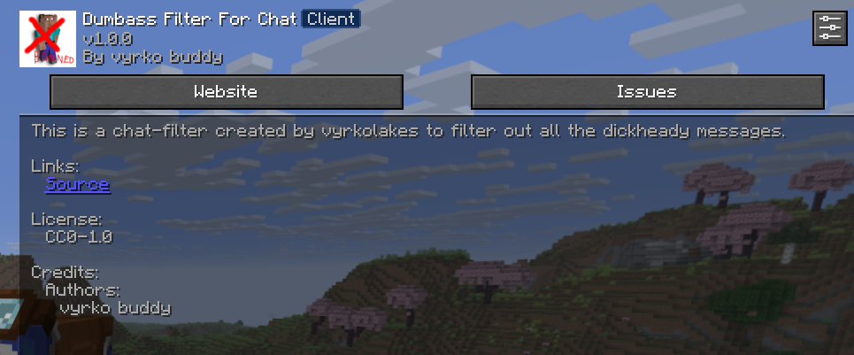

# Dumbass Chat Filter

A simple but surprisingly effective Fabric mod that lets you clean up your Minecraft chat however you want—block certain ranks, hide annoying messages, or filter out words you don’t want to see.

## 📋 Features

### 🎯 Rank-Based Filtering
- **Custom Rank List** – Choose which ranks you want to filter out (Legend, Prime, Elite, Apex, etc.)
- **Smart Bracket Detection** – Works with different bracket styles (`[Rank]`, `<Rank>`, `{Rank}`, `(Rank)`)
- **Case-Insensitive** – Matches ranks no matter how they’re written
- **Supports Multi-Word Ranks** – Handles things like “Prime Ultra” or “Elite Ultra”

### 🚫 Word Filtering
- **Custom Word/Phrase List** – Block specific words or phrases
- **Case Sensitivity Toggle** – Decide if caps matter
- **Whole Word Matching** – Avoids false positives by filtering only full words if you want
- **No Regex Needed** – Just type the words and you’re done

### ⚙️ Easy Configuration
- **In-Game GUI** – Fully configurable through Mod Menu
- **Automatic JSON Config** – Saved to `config/dumbass-filter.json`
- **Instant Updates** – Settings apply as soon as you save
- **Clean Layout** – Categories and options arranged in an easy-to-understand way

### 🎮 Client-Side Only
- **No Server Requirements** – Works anywhere without permissions
- **Lightweight** – Minimal performance cost
- **Private** – Everything happens on your own client

## 📦 Installation

### Requirements
- Minecraft **1.21.8** (Fabric)
- Fabric Loader **0.18.1+**
- Fabric API **0.136.1+1.21.8+**
- Cloth Config API **19.0.147+**
- Mod Menu **15.0.0+**

### How to Install
1. Grab the latest version from the [Releases](../../releases) page
2. Drop the `.jar` into your `.minecraft/mods` folder
3. Make sure the required dependencies are installed
4. Launch the game using Fabric

## 🎯 Usage

### Opening the Config Menu
1. Start Minecraft  
2. Go to **Mods**  
3. Select **Dumbass Chat Filter**  
4. Click the **Config** button to customize everything  

### Configuration Overview

#### General Settings
- **Enable Rank Filter** – Turn rank filtering on or off  
- **Enable Word Filter** – Enable or disable word/phrase filtering  

#### Rank Filter Settings
- **Filtered Ranks** – Add the ranks you want to block (e.g., `Legend`, `Prime`, `Elite`)  
- **Opening Brackets** – Characters that can appear before a rank tag  
- **Closing Brackets** – Characters that can appear after a rank tag  

#### Word Filter Settings
- **Filtered Words** – Words or phrases you want to block  
- **Case Sensitive** – Whether capitalization matters  
- **Whole Word Only** – Only blocks full matches (e.g., “bad” doesn’t filter “badass”)  
